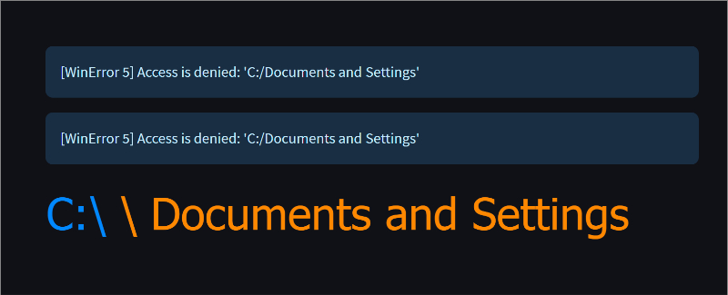

# Streamlit File Browser

This is a Streamlit application that acts as a file browser allowing you to navigate through folders and view the files and subfolders. It provides a convenient way to explore the file system and select files for further processing or analysis.

## Usage

The file browser is implemented using the Streamlit library in Python. To run the application, simply execute the provided code. The application will start in your web browser, and you can interact with it to navigate through the folders and view the files.

The initial view of the file browser shows the current directory and its subfolders and files. You can click on a subfolder to navigate into it and view its contents. Similarly, clicking on a file will perform the desired action on the file, such as opening it or processing it further.

## Features

- **Folder Navigation**: You can navigate through the folders by clicking on the subfolders in the file browser.
- **File Selection**: Clicking on a file will select it for further processing or analysis.
- **Dynamic Updates**: The file browser automatically updates to reflect changes in the directory structure or file system.
- **Breadcrumb Navigation**: The current folder path is displayed as a breadcrumb trail, allowing you to easily track your location within the file system.
- **Customization**: You can customize the font size and colors of the file browser to suit your preferences.

## Potential Improvements

- **File Actions**: Currently, the file browser only displays the files and folders. It could be enhanced to allow various actions to be performed on the files, such as opening, editing, or deleting them.
- **File Filtering**: Adding the ability to filter files based on their names, extensions, or other attributes would make it easier to find specific files in large directories.
- **Sorting**: Providing options to sort the files and folders alphabetically or by other criteria would improve the usability of the file browser.
- **File Previews**: Adding the ability to preview file contents (such as text or images) directly in the file browser would eliminate the need to open them in external applications for quick inspection.

## Conclusion

The Streamlit file browser is a useful tool for exploring and selecting files in a directory structure. It provides an intuitive user interface and can be easily customized and extended to suit different use cases. By implementing additional features and improvements, it can become a powerful file management and analysis tool.
